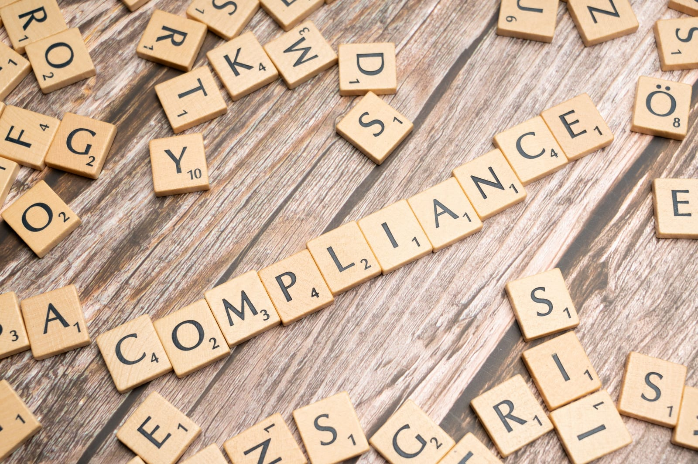

:::note
本篇內容是應《數位時代》邀請錄製 Podcast 時，把我知道跟經歷過的台美貿易相關議題作簡單的整理。我預期聽眾應該對這個議題比較陌生，所以忽略一些細節跟法規，但是多了點往事。隨意看看吧。
:::

## Q1｜主持人：「最近網通圈一直在講 NDAA，甚至扯到 SpaceX。為什麼一條美國國防法案，會變成台灣網通廠最頭痛的事？」

這個說法其實省略了不少東西。起因是華為這些中國大廠被美國禁掉，所以大家一直在談 NDAA（國防授權法案）。但除了 NDAA，要進入美國市場其實有三道關卡，每一道問的問題都不一樣。

### 第一道關卡：FCC

第一道關卡是 FCC，美國聯邦通訊委員會。它的角色有點像我們的 NCC，再加上 BSMI 管電磁相容的那一塊。任何會發射或產生射頻的電子產品，都要先拿到 FCC 認證，才能在美國進口跟銷售。

這一關以前很輕鬆，乖乖送測、拿到認證就好。可是從去年底開始，FCC 的邏輯變了。

一開始 FCC 的做法是點名：華為、中興、海康、大華這些廠商被列進一份管制清單，清單上的廠商拿不到新的認證。

但從 2025 年底的無人機開始，FCC 改成按產地整類列管。今年 3 月擴展到消費級路由器，7 月再加上逆變器和先進機器人。這條規則限制的是所有「外國生產」的相關產品，不分國家、不分品牌，也不管你是哪國公司。台灣製、日本製、德國製，全部一樣。

而且它對「生產」的定義非常寬：設計、開發、組裝、製造，任何一個主要階段在美國以外，就算外國生產。

這一條對台灣的 ODM 很傷。工廠再怎麼搬，軟硬體設計的工程師還是在台灣呀，難道我們就要放棄美國市場了嗎？

解法是去申請一張叫 Conditional Approval 的白名單，由國防部或國土安全部審核，效期 18 個月，而且申請時要交出把製造移回美國的計畫。連 Netgear 這種美國品牌、甚至 SpaceX 自己的 Starlink 設備，都得去排隊。不過這類申請要交的資料跟要做的保證不少，光這一點就擋掉了很多人。

簡單來說，FCC 這道關卡問的是一個很根本的問題：**這台設備，還能不能在美國賣？**

### 第二道關卡：NDAA

第二道關卡才是 NDAA，美國國防授權法案。它其實不是一條規則，而是美國國會每年都要通過的國防預算與政策法，每年都可能加進新條款。所以它是一份會一直長大的清單。

FCC 管的是「能不能在美國賣」，NDAA 管的是「能不能賣給美國政府」。而且它看的不是產品在哪裡做，而是你跟誰有關係。

NDAA 的限制主要分成兩層。第一層是負面表列：聯邦機關不能買華為、中興、海康、大華等中國公司的通訊與監控設備，也包括它們的子公司，例如華為旗下的海思晶片。

第二層更狠：所有跟聯邦政府做生意的承包商，自己公司內部也不能用這些設備，不管那台設備跟政府合約有沒有關係都一樣。

換句話說，會議室裡的一台海康攝影機，就可能讓一家公司失去跟整個美國聯邦政府簽約的資格。

這就是為什麼 SpaceX／Starlink 這種公司會這麼在意。它不只是商業公司，也是國防承包商，整家公司都在 NDAA 第 889 條的管制範圍裡。不合規的設備不但不能用在政府計畫上，連公司內部都不能用。所以對 SpaceX 這種買家來說，要的不是最便宜的設備，而是證明得出來、經得起稽核的乾淨設備。

而且這條規定還會跟著錢走：學校、電信業者只要拿了聯邦補助，補助款就不能拿去買這些設備。

講到這裡，很多人會以為是不是要全部用美國零件？不用。NDAA 是黑名單，不是白名單。不在黑名單上的東西都可以用，包括中國工廠生產的非管制零件，只要製造商不在名單上就沒問題。

NDAA 合規真正難的地方是「查不清」。拿最近最紅的記憶體來說，因為缺料、大家又要出貨，市面上就會出現模組上印的是 A 品牌，裡面的顆粒卻是別家做的。這種要怎麼查？

所以客戶會要求廠商一路追到晶片層級，說清楚每一顆東西是誰做的。這正是台灣這些牌子老、信用好的 ODM 的一大優勢：我們知道 BOM 上真的用了哪些料，換個替代料的流程繁瑣到不行，我們被迫誠實好些年了。

這個限制名單還在不停地長大。

今年 6 月起，美國國防部不能再跟它自己點名的中國軍事企業直接簽約。2027 年底起，含有中芯、長江存儲、長鑫存儲晶片的產品，聯邦政府也不能買了。之前 Apple 還傳出要用長江/長鑫的記憶體跟 eMMC，伺服器跟電腦的記憶體目前還在極度短缺，影響非常大。

所以 NDAA 這道關卡問的是：**這台設備裡面，有沒有不該有的東西？**

### 第三道關卡：TAA

第三道關卡是 TAA，美國的《貿易協定法》，1979 年通過。

NDAA 問的是血統：你有沒有用不該用的東西。TAA 問的是地理：這台設備最後是在哪個國家完成的？

規則是這樣：美國聯邦政府的採購合約，只要金額超過 17 萬 4 千美元，產品就必須在美國，或是跟美國簽了貿易協定的「合格國家」完成實質轉型。另外，如果你的產品想上 GSA Schedule，也就是美國政府的官方採購型錄，類似台灣的台銀共同供應契約，那不管單筆訂單多小，一律要符合 TAA。

哪些是合格國家？台灣、日本、韓國、歐盟、加拿大這些 WTO 政府採購協定的成員，加上墨西哥、澳洲這些跟美國有自由貿易協定的國家。不合格的呢？當然就是中國、越南、俄羅斯這些跟美國沒有協定的國家。

這裡要特別提一下越南。2019 年中美貿易戰之後，很多廠商把產線搬去越南，但那是為了躲關稅，不是為了 TAA。越南不是合格國家，搬過去對賣美國政府一點幫助都沒有。

那什麼叫「實質轉型」？法院的判斷標準是：你的加工有沒有讓產品的名稱、特性、用途產生改變。簡單說，就是你在這裡做的事，有沒有讓一堆零件變成一台新的東西。

這裡有個很反直覺的地方：TAA 不追零件來源。中國產的電阻、電容，拿到台灣打件、組裝、燒韌體、測試，就構成實質轉型。這台設備就是台灣製，TAA 照樣合規。這跟 NDAA 剛好相反：NDAA 一路追到晶片，TAA 只看最後一站。

剛剛說 TAA 管的是 17 萬 4 千美元以上的聯邦採購，那低於這個金額的呢？理論上要改走另一部更老的法律，叫 Buy American Act，要求美國製造。但市售的商用 IT 產品從 2004 年起就被豁免了。所以對網通業來說，實務上真正要過的就是 TAA 這一關。

最後，TAA 是廠商自己聲明、自己負責。聲明不實，美國司法部可以用《不實請求法》（False Claims Act）追訴，罰的是三倍賠償。而且去告你的，往往不是政府，是你的競爭對手。

所以 TAA 這道關卡問的是：**這些零件，最後是在哪裡變成這台設備的？**

---

以前網通廠跟美國人做生意，先談的是規格跟價錢。現在客戶的先決條件是：先看你的 BOM 乾不乾淨、你的工廠到底在哪裡。

## Q2｜主持人：「那台灣廠在這些規則裡，是有優勢還是劣勢？」

這要看你在哪個年代問。台灣在美國規則裡的位置一直在變，而台灣廠這二十多年來，其實一直在規則的邊上找出路。

2009 年以前，台灣還沒加入 WTO 政府採購協定。所以那個年代，Made in Taiwan 在美國政府採購裡跟 Made in China 待遇完全一樣：都不合格。

於是業界發展出兩套做法。

第一套是在台灣或其他國家做硬體，送到美國寫韌體、燒韌體，主張產品在美國完成了實質轉型，讓它在法律上變成美國貨。

這不是亂來。1982 年美國法院就有判例，認定在美國對晶片寫入程式可以構成實質轉型。那時候業界管這叫 MIA：Made in America。

另一條路是往南走。如果你去美墨邊境，德州艾爾帕索對面有一個城市叫華雷斯。1998 年，宏碁是第一家去那裡設廠的台灣公司，後來鴻海、華碩、緯創都跟著去了。

台商在華雷斯其實蓋了三波廠，每一波回應的都是不同的規則：

**第一波**是因應北美自由貿易協定。一方面降低關稅，另一方面個人電腦在邊境組裝，卡車隔天就到美國倉庫，拚的是交期。

**第二波**是 2018 年之後，中國製被課 301 關稅。把最後一站搬到墨西哥，產地就不再是中國了。

**第三波**就是現在的 AI 伺服器。美國雲端大廠直接要求台灣代工夥伴把產能移出中國，英業達、和碩、緯穎都在華雷斯擴廠，鴻海在瓜達拉哈拉蓋了全世界最大的 GB200 組裝基地。除了商業和政治上的要求，另一個重點是 AI 伺服器都是整櫃出貨，最小單位就是一個機櫃。伺服器本身就重得要命，一整個機櫃更不用說。在墨西哥可以走陸運，方便又便宜多了。不過這是題外話，跟今天主題無關。

而且墨西哥是美國的自由貿易夥伴，在 TAA 下也是合格國家。

到了今天，在 NDAA 和 TAA 這兩道門前面，台灣的 ODM 和網通業者是有優勢的。我們是合格國家，供應鏈也做得到乾淨、查得清楚。剛剛說台灣老牌 ODM 被迫誠實，這在 NDAA 時代反而變成了本錢。

但在 FCC 這道門前面，台灣又回到了劣勢。而且這裡有個很有意思的諷刺：

當年的 MIA，是靠「美國開發、美國燒韌體」，或是北美自由貿易協定下的墨西哥生產，把台灣貨變成 TAA 合格產品。今天 FCC 對外國生產的定義，把設計和開發也算進去了。所以不管硬體在哪裡做，只要軟硬體設計在台灣，你就是外國生產。當年讓台灣貨變成 TAA 合格的那條路，現在從另一頭被封死了。

墨西哥也一樣。華雷斯的工廠可以幫你過 TAA、避開中國產地，但在 FCC 眼中，墨西哥製還是外國製，一樣要去排 Conditional Approval。所以墨西哥對 AI 伺服器很有用，因為伺服器不在 FCC 的列管類別裡；但對消費級路由器，幫助就很有限。

所以我個人的結論是：去中國化的紅利，台灣吃得到。但「去外國化」，或者說 Make America Great Again 這一題，台灣跟所有人一樣，都站在門外排隊。

## Q3｜主持人：「你說去中國化的紅利台灣吃得到。那會不會有人想搭便車，把中國貨包裝成台灣貨？」

會，而且已經有人被抓了。

先說為什麼這個誘惑這麼大。一台產品如果產地是中國，賣美國要被課高額關稅，也不能賣美國政府，因為過不了 TAA。但如果產地變成台灣，關稅少了，TAA 也過了。同一台東西，換一張產地標籤，兩個門檻一次過。

去年底就有一個案子。一家公司把中國製的碳化鎢產品經台灣轉運、申報台灣原產，用來躲關稅，最後跟美國司法部和解 5,440 萬美元，是《不實請求法》史上最大的海關詐欺和解。台灣在這個案子裡不是受益者，而是被拿來洗產地的跳板。

那這種事怎麼判斷？核心還是實質轉型。

也就是在台灣做的加工，有沒有讓產品的名稱、特性、用途產生改變。如果真的在台灣打件、組裝、燒韌體、測試，零件從哪裡來都沒關係，產地就是台灣。

但如果只是換包裝、貼標籤，或是散件運來鎖幾顆螺絲，也就是 CKD、SKD 那種簡單組裝，那就不算。2016 年美國有一個手電筒的案子，法院就認定這種組裝不構成實質轉型。對網通產品來說，海關最看重的通常是主板在哪裡打件。

而且抓你的往往不是政府，是你的競爭對手。《不實請求法》允許民間吹哨提告，吹哨人可以分到追回金額的 15% 到 30%，那個台灣轉運案的吹哨人就分到將近一千萬美元。你工廠裡到底有沒有 SMT 產線，你的同業最清楚。

不過，TAA 和關稅這兩關，至少還有人敢賭。FCC 那一關，是連洗都沒得洗。

剛剛講過，FCC 把設計和開發也算進產地。現實上工程師不可能全部搬去美國，所以台灣廠不管多老實，一樣要去排 Conditional Approval。目前台灣已經有些廠商拿到 Approval 了。

我覺得這個設計非常聰明。

它不是全面禁止，而是讓大部分廠商有路可走，也不會對美國市場造成立即性的傷害。結果就是到目前為止，我還沒看到有人為了路由器這條去法院告。對照之下，無人機那條，大疆是直接上法院的。

但這張白名單只有 18 個月，其實就是一個倒數計時。這 18 個月裡，廠商要交出把製造移回美國的進度，不然到期就斷。

而且它的範圍還在長大。目前只管消費級路由器，企業級設備、資料中心交換器還不在內。但你看它的節奏：2025 年底無人機、今年 3 月路由器、7 月逆變器和機器人，一類一類往上加。企業級產品還沒被管，只代表還沒輪到，不代表安全。

所以你會發現，「台灣製」這三個字，在 NDAA 眼中是資產，在 FCC 眼中是待處理項目。

題外話，我個人覺得搭便車不是好事。「台灣製」的信用是整個產業共用的。台灣廠今天去申請白名單，要大量揭露股權結構、供應鏈、製造地點，審查的人信不信你，靠的就是台灣長年累積的信用。

如果轉運案越來越多，美國看每一張台灣原產地證明、每一份台灣廠的白名單申請，眼光都可能會變。到時候付代價的，不只是那幾家搭便車的公司，而是所有老老實實在台灣蓋產線、老老實實排隊的廠商。

## Q4｜主持人：「那最後，到底誰能賣設備給 SpaceX？」

我不能回答是哪家公司，但可以回答是什麼樣的公司。

**第一，真實的製造能力。** 實打實的打件產線，經得起海關和客戶稽核，而不是一個鎖螺絲的包裝站。

**第二，可以稽核的料表。** 美國國土安全部已經有一套硬體料表框架，叫 HBOM，FCC 也在徵詢要不要強制要求。法律現在還沒逼你交，但客戶已經開始要了。能一路追到晶片層級、說清楚每一顆東西是誰做的，這才是新的門票。

**第三，看清楚台灣的雙面性。** 在 NDAA 的血統題上，台灣是贏家；但在 FCC 的地理題上，台灣跟所有外國一樣，都在倒數計時。

所以這不是一場台灣穩贏的制度紅利。去中國化的紅利，台灣已經開始吃了，但美國下一階段的遊戲規則是「去外國化」。只有願意提早下苦工，把料表整理乾淨、把整串供應鏈理順，並且認真評估美國在地製造選項的廠商，才有機會。

回到今天的題目：誰能賣設備給 SpaceX？我的答案是，關鍵不在價格，而在你的料表跟生產履歷能不能攤開來給人檢驗。
